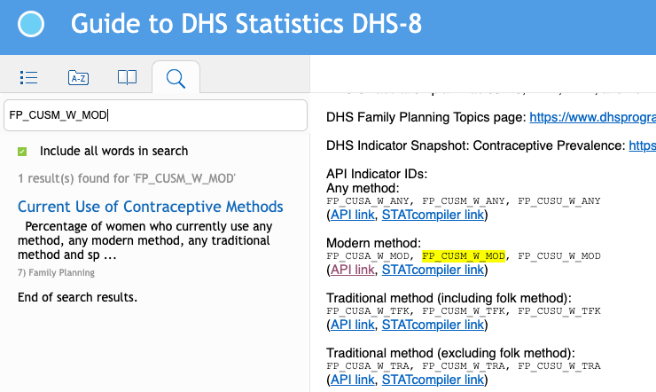
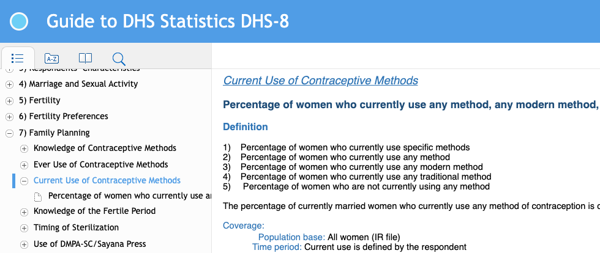
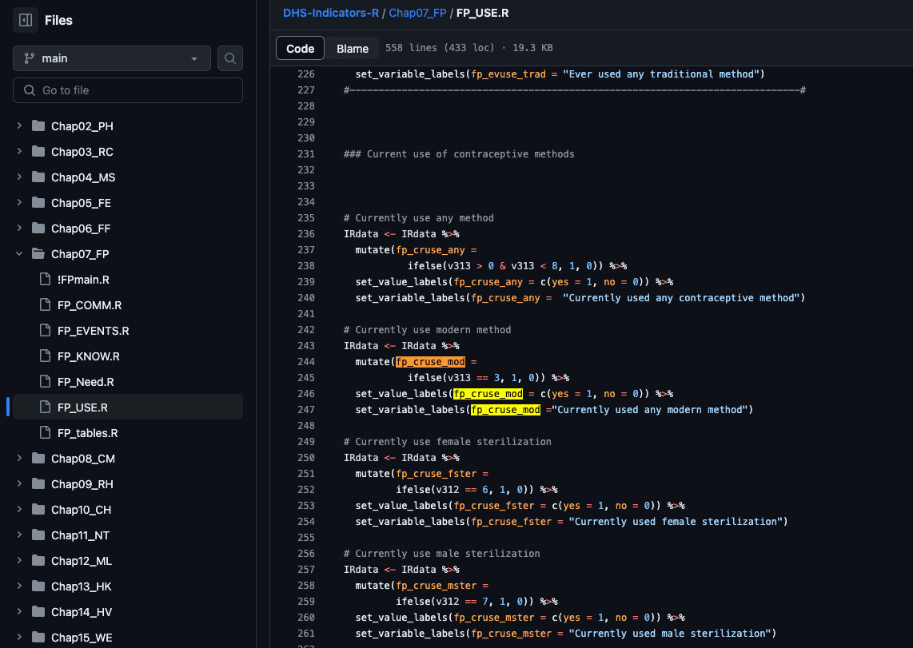

```{r setup, include=FALSE}
knitr::opts_chunk$set(echo = TRUE, message = FALSE, warning = FALSE, tidy = TRUE, eval=TRUE)
```


In this vignette, we provide an overview of the list of DHS indicators currently implemented in **surveyPrev** and the process to add new indicators or create customized indicators. 


First we load the **surveyPrev** package, and any packages used in the customized indicator processing function later. In our example, **dplyr** and **labelled** are used. 

```{r, message=FALSE,warning=FALSE}
library(surveyPrev)
library(dplyr)
library(labelled)
```

In order to use `getDHSdata()` to download the relevant DHS data directly from the DHS website, we need to 

1. register with DHS to gain data access, and
2. set up a DHS account details in R using `rdhs` package, i.e.,

```{r,eval=FALSE}
rdhs::set_rdhs_config(email = "your_email",
                project = "your_registered_DHS_project_title")
```


# Built-in indicators

Currently, the `surveyPrev` package supports the following indicators: 

- `ancvisit4+`: Percentage of women who had a live birth in the five years before the survey who had four or more antenatal care visits.
- `womananemia`: Percentage of women aged 15-49 classified as having any anemia (<12.0 g/dl for non-pregnant women and <11.0 g/dl for pregnant women).
- `stunting`:   Percentage of children under age five stunted (below -2 standard deviations of height-for-age according to the WHO standard).
- `wasting`:    Percentage of children under age five with a weight-for-height z-score (WHZ) more than two standard deviations below the median WHO growth standards.
- `DPT3`:   Diphtheria-tetanus-pertussis (DPT3) received; Percentage of children aged 12-23 months who had received a third DPT dose.
- `sanitation`: Percentage of households using an improved sanitation facility.
- `unmet_family`: Percentage of all women with an unmet need for family planning for spacing and limiting.


These indicators above can be directly processed within **surveyPrev** using `getDHSdata()` and `getDHSindicator()` functions. `getDHSindicator()` processes the raw survey data into a `data.frame`, where the column titled `value` is the indicator of interest. It also contains cluster ID, household ID, survey weight and strata information. This data format allows a `svydesign` object to be defined in the `survey` package. For example,  

```{r,message=FALSE,warning=FALSE}
indicator <- "unmet_family"
year <- 2018
country <- "Zambia"
dhsData1 <- getDHSdata(country = country, indicator = indicator, year = year)
data1 <- getDHSindicator(dhsData1, indicator = indicator)
head(data1)
```

If the DHS download using the API fails, you may also manually download the file from the DHS website and read into R. The `getDHSdata()` function returns a message specifying which file is used (e.g., Individual Record file for the ANC visit example).


# New indicators


Details on how standard DHS indicators are defined can be found in the [Guide to DHS Statistics:https://dhsprogram.com/data/Guide-to-DHS-Statistics/](https://dhsprogram.com/data/Guide-to-DHS-Statistics/index.htm#t=Table_of_Contents.htm&rhsyns=%20&ux=search) by searching for an indicator. Codes for creating most standard DHS indicators can be found on DHS GitHub site: [https://github.com/DHSProgram/DHS-Indicators-R](https://github.com/DHSProgram/DHS-Indicators-R). The indicators are organized by chapters in the [Guide to DHS Statistics](https://dhsprogram.com/data/Guide-to-DHS-Statistics/index.htm#t=Table_of_Contents.htm&rhsyns=%20&ux=search). 


To use **surveyPrev** to create a new indicator not already built into the package, we need to specify

1. which DHS data file to download, 
2. a customized function to process the indicator from the raw HDS survey data.

## DHS dataset types

The table below lists the different types of DHS data and their naming conventions in **surveyPrev**. You can find more details in this [website](https://dhsprogram.com/data/dataset-types.cfm)

```{r, echo = FALSE}
d <- data.frame(Name = c( "MRdata",
                          "PRdata",
                          "KRdata",
                          "BRdata",
                          "CRdata",
                          "HRdata",
                          "IRdata"), 
                Recode = c( "Men's Recode",
                            "Household Member Recode", 
                            "Children's Recode", 
                            "Births Recode", 
                            "Couples' Recode", 
                            "Household Recode", 
                            "Individual Recode"))
knitr::kable(d,
             caption = "DHS data types")
```


## Function to process the indicator


Let's take **Modern contraceptive prevalence rate (Married women currently using any modern method of contraception)** as an example. For users familiar with the standard indicators defined by the [DHS Data Indicator API](https://api.dhsprogram.com/rest/dhs/indicators?returnFields=IndicatorId,Label,Definition&f=html), the indicator ID is "FP_CUSA_W_MOD". We will go through the steps to create the customized function below.


**Step 1**: Search indicator ID or key words in the [Guide to DHS Statistics](https://dhsprogram.com/data/Guide-to-DHS-Statistics/index.htm#t=Table_of_Contents.htm&rhsyns=%20&ux=search), and then identify which chapter it is in.

For our example, we can either search "FP_CUSA_W_MOD", or "contraceptive", and it is in chapter 7: family planning.

```{r, echo = FALSE, out.width = "100%", fig.cap = "Step 1(a): Searching for indicator ID or key words."}

```


```{r, echo = FALSE, out.width = "100%", fig.cap = "Step 1(b): Identifying which chapter the indicator is from."}

```

**Step 2**: We can download [IndicatorList.xlsx](https://github.com/DHSProgram/DHS-Indicators-R/blob/main/IndicatorList.xlsx) from [DHS GitHub site](https://github.com/DHSProgram/DHS-Indicators-R), and search keyword again in the the corresponding chapter to find out 

1. which DHS data recode is used to create this indicator 
2. which file contains the code to create this indicator in the DHS GitHub repository. 
3. what the corresponding variable name is in the DHS GitHub repository. 

For our example, since we are looking up for the indicator of married women currently using any modern method of contraception, we identify the cell "currently use any modern method", and find out that the code to process this indicator is in the FP_USE.do file and we need IRdata (Individual Recode). We also identify the variable name used in the R codes on the Github repository is "fp_cruse_mod".  We will all three pieces of information in the next step to find the codes processing the indocator.

```{r, echo = FALSE, out.width = "100%", fig.cap = "Step 2: Finding file name and recode name."}
knitr::include_graphics("figs/data3.png")
```

**Step 3**:  In the Github repository, we find the folder for Chapter 7, the file FP_USE.R, and search "fp_cruse_mod" to find the following chunk of code script.

```{r, echo = FALSE, out.width = "100%", fig.cap = "Step 3: Finding code."}

```

We extract the following chunk of codes for this indicator, which takes the IR data, and perform a few steps of data cleaning.

```{r, eval=FALSE}
# Currently use modern method
IRdata <- IRdata %>%
  mutate(fp_cruse_mod = 
           ifelse(v313 == 3, 1, 0)) %>%   
  set_value_labels(fp_cruse_mod = c(yes = 1, no = 0)) %>%
  set_variable_labels(fp_cruse_mod ="Currently used any modern method")
```

We can use the code chunk to define a new function to be used in the `getDHSindicator` function. The self-defined function should:

- Use Recode file as input and return the same data.frame.
- Change the name of your variable into `"value"` in the end.

The example below creates a `fp_cruse_mod` function for "Modern contraceptive prevalence rate (All women currently using any modern method of contraception)", which can be recognized by the `getDHSindicator` function later.

```{r}
fp_cruse_mod <- function(RData){
        IRdata <- RData %>%
          mutate(fp_cruse_mod = 
                   ifelse(v313 == 3, 1, 0)) %>%   
          set_value_labels(fp_cruse_mod = c(yes = 1, no = 0)) %>%
          set_variable_labels(fp_cruse_mod ="Currently used any modern method")
          colnames(IRdata)[colnames(IRdata) == 'fp_cruse_mod'] <- "value"
          return(IRdata)
}
```

Finally, after we create this function `fp_cruse_mod`, We can create the indicator by 

1. Use `getDHSdata` function to downloading relevant DHS datasets using the identified DHS data type in Step 3. In this example we specify `Recode = "Individual Recode"` and `indicator = NULL`, The  recode be one of the recode lists in table 1. to download the dataset. We can also set `Recode = NULL`, in which case all available DHS data types will be downloaded.
2. Use the function `FUN = fp_cruse_mod` in the call of `getDHSindicator` to process the indicator according to the customized function.

Altogether, the following codes creates the dataset of the processed indicator.

```{r, eval=TRUE}
year <- 2018
country <- "Zambia"
Recode <- "Individual Recode"
dhsData <- getDHSdata(country = country, indicator = NULL, Recode=Recode,year = year)
data <- getDHSindicator(dhsData, indicator = NULL,
                          FUN = fp_cruse_mod)
head(data)
```


# Multiple dataset

Some indicators, such as HIV prevalence, require an additional data file. Take, HIV prevalence among general population, as an example. This is a built-in indicator with the ID "HA_HIVP_B_HIV". It needs three Recode files: Individual, Men's and HIV Test Results, so that the output of `getDHSdata()` and the input for `getDHSindicator()` are a list of three data files. 

```{r,eval=FALSE}
HIVdhsData <- getDHSdata(country = country, indicator = NULL, Recode = c("Individual Recode", "Men's Recode","HIV Test Results Recode"), year = year)
```


